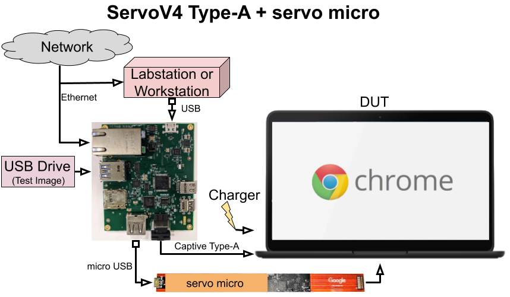
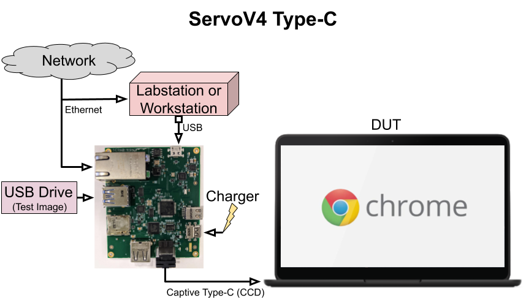
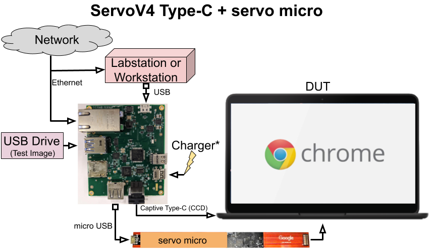
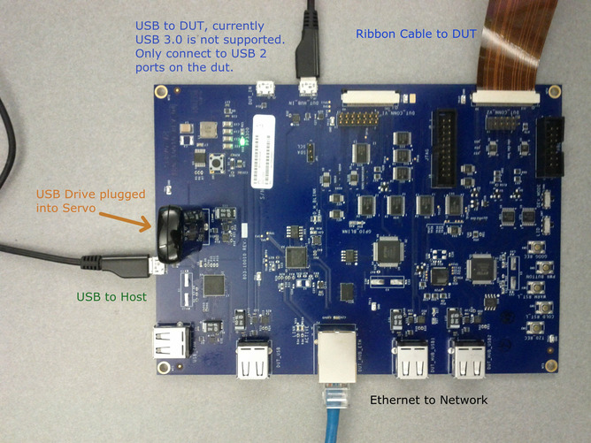

# How to run FAFT (Fully Automated Firmware Test) {#faft-how-to-run}

_Self-link: [go/faft-running](https://goto.google.com/faft-running)_

[TOC]

## FAFT Overview {#faft-overview}

[FAFT] (Fully Automated Firmware Tests) is a collection of tests and related
infrastructure that exercise and verify capabilities of ChromeOS.
The features tested by FAFT are implemented through low-level software
(firmware/BIOS) and hardware. FAFT evolved from SAFT
(Semi-Automated Firmware Tests) and you can locate tests in the [FAFT suite]
in the Autotest tree as directories with the prefix `firmware_`.

The founding principles of FAFT are:

- Fully automated, no human intervention required
- Real test of physical hardware, like USB plug-in, Ctrl-D key press
- High test coverage of complicated verified boot flows
- Easy to integrate with existing test infrastructure (e.g. test lab, continuous testing, etc).

To access some of these low-level capabilities, the tests require a
[servod] instance running and executing controls with the help of physical
[servo] board ([servo v2], [servo v4] with [servo micro] or [servo v4 Type-C])

The servo board is connected directly to the DUT (Device Under Test) to enable
access to low-level hardware interfaces, as well as staging areas for backup
software (on a USB drive).

The [FAFT framework] runs the tests with a tool called [test that] and it is
based on a client-server architecture, where the client runs on the DUT and
the server runs on the host machine.

The tests may corrupt various states in the EC, firmware, and kernel to verify
recovery processes. In these cases you can almost always use FAFT to restore
the system to its original state.
The FAFT suite of tests can be invoked locally or remotely.
This document describes how to set up the local configuration only.

The ChromeOS firmware controls, among other things, the initial setup of the
system hardware during the boot process. They are necessarily complicated,
providing reliability against various corruption scenarios and security to
ensure trusted software is controlling the system. Currently, the purpose of
FAFT is to exercise EC firmware and BIOS firmware functionality and performance.

## Hardware Setup {#hardware-setup}

### General requirements

The firmware running on the system needs to be able to deal with the
signatures on the disks, so when testing your own local ChromeOS build
signed with dev keys, install dev signed firmware as well.

The setup requires a USB drive: Pick the fastest option that you can
reasonably employ but even more than that, ensure that it's reliable!
If the drive is quirky in manual use, FAFT will definitely be confused
because it won't be able to deal with extraordinary circumstances.

The OS image installed on the USB drive MUST NOT be a recovery image. FAFT
switches pretty often between normal and dev mode, and the transition into
dev mode is done by going through the recovery screen. With a recovery
image present, it will do a recovery instead of going through the dev
mode transition flow.

The OS on the USB drive and on the disk must be a test image. If not, it
will lack important tooling for running the tests: If you see messages
that `rsync` can't be found you're not using a test image and while
this step will work (albeit slowly because the fallback is to scp files
individually), running the DUT's side of the tests will fail because
non-test ChromeOS lacks a suitable python interpreter.

### ServoV4 Type-A with Micro {#servov4-typea-micro}

The hardware configuration for running FAFT on a servo v4 Type-A
with servo micro includes:

- A test controller (your host workstation with a working chroot environment)
- The test device (a device / DUT that can boot ChromeOS)
- A servo board
- Related cables and components
    - servo-micro cable
    - USB type-A to USB micro cable for DUT connection (~ 2' in length)
    - USB type-A to USB micro cable for test controller connection (~ 4' - 6' in length)
    - Ethernet cable
    - USB drive (flashed with the appropriate OS image)

Figure 1 shows a diagram of how to connect the latest debug boards,
servoV4 Type-A and servo micro, to the test controller, DUT, and network.
It is important to ensure the DUT is powered off
before plugging in cables and components to the servo.



**Figure 1.Diagram of hardware configuration for a ServoV4 Type-A with servo micro.**

Details of servoV4 Type-A with micro connections:

1. Connect one end (micro USB) of the servo micro to servoV4 using a micro USB to USB cable.
2. Connect the servo micro to the debug header on the chrome device.
3. Connect the USB type A cable of the servoV4 to the DUT.
4. Prepare a USB flash drive with valid ChromeOS image and plug into the USB port of the servo as shown in the diagram.
5. Connect the micro USB port of the servo to the host machine (typically your workstation).
6. Connect an Ethernet cable to the Ethernet jack of the servo that goes to the a network reachable from the network that your host machine is on.

### ServoV4 Type-C {#servov4-typec}

The hardware configuration for running FAFT with a servo v4 type-C includes:

- A test controller (your host workstation with a working chroot environment)
- The test device (a device / DUT that can boot ChromeOS)
- A servo board
- Related cables and components
    - USB type-A to USB micro cable for test controller connection (~ 4' - 6' in length)
    - Ethernet cable
    - USB drive (flashed with the appropriate OS image)

Figure 2 shows a diagram of how to connect a servoV4 Type-C, to the test
controller, DUT, and network. It is important to ensure the DUT is powered off
before plugging in cables and components to the servo and DUT.



**Figure 2.Diagram of hardware configuration for a ServoV4 Type-C.**

Details of servoV4 Type-C connections in Figure 2:

1. Connect the USB Type-C cable of the servoV4 to the DUT.
2. Prepare a USB flash drive with valid ChromeOS image and plug into the USB port of the servo as shown in the diagram.
3. Connect the micro USB port of the servo to the host machine (typically your workstation).
4. Connect an Ethernet cable to the Ethernet jack of the servo that goes to the a network reachable from the network that your host machine is on.

### ServoV4 Type-C with servo micro {#servov4-typec-micro}

Make sure to use the following servo type and configuration
for running the faft_pd suite or the faft_cr50 suite (note: the cr50 suite
requires special images so is not runnable outside of Google).  This setup
requires servod to be in "DUAL_V4" mode.  You should generally only use this
setup for faft_pd and faft_cr50, faft_ec and faft_bios do not expect servod to
be in DUAL_V4 mode.



**Figure 3.Diagram of hardware configuration for a ServoV4 Type-C with servo micro.**

Details about FAFT PD's ServoV4 Type-C + servo micro setup (Figure 3):

- The suite should only be run on devices released in 2019 and forward.
- The charger connected to the servo must have support for 5V, 12V, and 20V.
- The servo v4 and servo micro cable must be updated to their latest FW:
    - Servo_v4: servo_v4_v2.3.30-b35860984
    - servo micro: servo_micro_v2.3.30-b35960984

To check or upgrade the FW on the servo v4 and servo micro, respectively, before kicking off the FAFT PD suite:

- Have the servo v4 connected to your workstation/labstation along with the servo micro connected to the servo.
- Run the following commands on chroot one after the other:
    - sudo servo_updater -b servo_v4
    - sudo servo_updater -b servo_micro

### (Deprecated) ServoV2 {#servov2-deprecated}

(Deprecated) The following photo shows the details how to connect the older,
deprecated servo v2 board to the test controller, test device, and network.



**Figure 4.Diagram of hardware configuration for a ServoV2 board.**

Details of servo v2 connections:

1. Connect one end(ribbon cable) of the flex cable to servoV2 and the other end to the debug header on the chrome device.
2. Connect DUT_HUB_IN(micro USB port) of the servo to the DUT.
3. Prepare a USB flash drive with valid ChromeOS image and plug into the USB port of the servo as shown in the photo.
4. Connect the micro USB port of the servo to the host machine(workstation or a labstation).
5. Connect an Ethernet cable to the Ethernet jack of the servo.

### Installing Test Image onto USB Stick {#image-onto-usb}

After the hardware components are correctly connected,
prepare and install a test Chromium OS image:

1. Build the binary (chromiumos_test_image.bin) with build_image test, or fetch the file from a buildbot.
2. Load the test image onto a USB drive (use cros flash).
3. Insert the USB drive into the servo board, as shown in the photo.
4. Install the test image onto the internal disk by booting from the USB drive and running chromeos-install.

## Running Tests {#faft-running-tests}

FAFT tests are written in two different frameworks: Autotest and Tast.

Autotest tests are run using the `test_that` command, described below. Tast tests are run using the `tast run` command, which is documented at [go/tast-running](http://chromium.googlesource.com/chromiumos/platform/tast/+/HEAD/docs/running_tests.md).

### Get tast private repo {#tast-tests-private}

There is at least one test that needs a secret key to get access to the ChromeOS
login screen, and that key will not be there if you only have the public manifest
checked out in your chroot.  To get the missing key create the file
`~/chromiumos/.repo/local_manifests/tast-tests-private.xml` with the contents:

```
<?xml version="1.0" encoding="UTF-8"?>
<manifest>
  <remote name="cros-internal"
          fetch="https://chrome-internal.googlesource.com"
          review="https://chrome-internal-review.googlesource.com">
    <annotation name="public" value="false" />
  </remote>
  <remote name="chrome"
          alias="cros-internal"
          fetch="https://chrome-internal.googlesource.com">
    <annotation name="public" value="false" />
  </remote>
  <project path="src/platform/tast-tests-private"
           remote="cros-internal"
           name="chromeos/platform/tast-tests-private" />
</manifest>
```

and then run `repo sync`.  If you cannot complete this step, you will have at
least one test fail with the error `runtime variable
ui.signinProfileTestExtensionManifestKey is missing`. In that case you should
ask someone at Google to run that one failing test for you if you need that
result.

### Setup Confirmation {#setup-confirmation}

To run Autotest tests, use the `test_that` tool, which does not automatically
start a `servod` process for communicating with the servo board. Running FAFT
is easiest with `servod` and `test_that` running in separate terminals inside
the SDK, using either multiple SDK instances (`cros_sdk --enter --no-ns-pid`)
or a tool such as `screen` inside an SDK instance. Before running any tests, go
into the chroot:

1.  Make sure your tools are up to date.
    1.  Run `repo sync -j8`
    2.  Run `./update_chroot`
2.  (chroot 1) Run `$ sudo servod --board=$BOARD` where `$BOARD` is the code name of the board you are testing. For example: `$ sudo servod --board=eve`
3.  Go into a second chroot
4.  (chroot 2) Run the `firmware_FAFTSetup` test to verify basic functionality and ensure that your setup is correct.
5.  If test_that is in `/usr/bin`, the syntax is `$ /usr/bin/test_that --autotest_dir ~/trunk/src/third_party/autotest/files/ --board=$BOARD $DUT_IP firmware_FAFTSetup`
6.  Run the `firmware.Pre.normal` test to verify tast tests are working also. `tast run --var=servo=localhost:9999 $DUT_IP firmware.Pre.normal`

You can omit the --autotest_dir if you have built packages for the board and want to use the build version of the tests, i.e.:

(chroot) `$ ./build_packages --board=$BOARD` where `$BOARD` is the code name of the board under test
(chroot) `$ /usr/bin/test_that --board=$BOARD $DUT_IP firmware_FAFTSetup`

### Sample Commands {#sample-commands}

A few sample invocations of launching Autotest tests against a DUT:

Running FAFT test with test case name

- `$ /usr/bin/test_that --autotest_dir ~/trunk/src/third_party/autotest/files/ --board=$BOARD $DUT_IP f:.*DevMode/control`

Some tests can be run in either normal mode or dev mode, specify the control file

- `$ /usr/bin/test_that --autotest_dir ~/trunk/src/third_party/autotest/files/ --board=$BOARD $DUT_IP f:.*TryFwB/control.dev`

FAFT can install ChromeOS image from the USB when image filename is specified

- `$ /usr/bin/test_that --autotest_dir ~/trunk/src/third_party/autotest/files/ --board=$BOARD $DUT_IP --args "image=$IMAGE_FILE" f:.*RecoveryButton/control.normal`

To update the firmware using the shellball in the image, specify the argument firmware_update=1

- `$ /usr/bin/test_that --autotest_dir ~/trunk/src/third_party/autotest/files/ --board=$BOARD $DUT_IP --args "image=$IMAGE_FILE firmware_update=1" f:.*RecoveryButton/control.normal`

Run the entire faft_bios suite

- `$ /usr/bin/test_that --autotest_dir ~/trunk/src/third_party/autotest/files/ --board=$BOARD $DUT_IP suite:faft_bios`

Run the entire faft_ec suite

- `$ /usr/bin/test_that --autotest_dir ~/trunk/src/third_party/autotest/files/ --board=$BOARD $DUT_IP suite:faft_ec`

Run the entire faft_pd suite

- `$ /usr/bin/test_that --autotest_dir ~/trunk/src/third_party/autotest/files/ --board=$BOARD $DUT_IP suite:faft_pd`

To run servod in a different host, specify the servo_host and servo_port arguments.

- `$ /usr/bin/test_that --autotest_dir ~/trunk/src/third_party/autotest/files/ --board=$BOARD $DUT_IP --args "servo_host=$SERVO_HOST servo_port=$SERVO_PORT" suite:faft_ec`

To run multiple servo boards on the same servo host (labstation), use serial and port number.

- `$ sudo servod --board=$BOARD --port $port_number --serial $servo_serial_number`
- `$ /usr/bin/test_that --autotest_dir ~/trunk/src/third_party/autotest/files/ --board=$BOARD $DUT_IP --args "servo_host=localhost servo_port=$port_number faft_iterations=5000" f:.*firmware_ConsecutiveBoot/control`

### Running Against DUTs With Tunnelled SSH

If you have ssh tunnels setup for your DUT and servo host (for example, via
[SSH watcher](https://chromium.googlesource.com/chromiumos/platform/dev-util/+/HEAD/contrib/sshwatcher),
the syntax (with the assumption that your DUT's network interface and your servo
host's network interface is tunnelled to 2203 and servod is listening on port
9901 on your servo host) for running tests is:

- `$ test_that localhost:2222 --args="servo_host=localhost servo_host_ssh_port=2223 servo_port=9901 use_icmp=false" $TESTS`
- `$ tast run -build=false -var=servo=127.0.0.1:9901:ssh:2223 127.0.0.1:2222  $TESTS`

Note that for tast, you will likely need to manually start servod.  Note that
the tast invocation is a bit unintuitive, as the servo port in the first port
reference is the real servo port on the servo host, not the redirected one,
because TAST ssh's to the servohost and tunnels it's own port.  If you don't
need to run commands on the servo host you can also use
servo=localhost:${LOCAL_SERVO_PORT}:nossh

## Running FAFT on a new kernel {#faft-kernel-next}

The lab hosts shown in go/cros-testing-kernelnext provide a static environment
for FAFT to be executed continuously and the recommendation is to pursue the
sustainable approach of using these DUTs for kernel-next FAFT execution.

Local execution via go/faft-running may be required to debug layers of
accumulated problems in boards where end-to-end integration tests lack an
effective continuous execution. Install a kernelnext image onto the test USB
stick and ensure that a kernelnext image is also installed in the DUT prior
to running FAFT. The test_that commands to execute tests on a DUT with a
kernelnext OS are the same.

The key point is to ensure that the USB and DUT contain a kernelnext image.

## Frequently Asked Questions (FAQ) {#faq}

Q: All of my FAFT tests are failing. What should I do?

- A1: Run `firmware_FAFTSetup` as a single test. Once it fails, check the log and determine which step failed and why.
- A2: Check that the servo has all the wired connections and a USB drive with the valid OS plugged in.  A missing USB drive is guaranteed to make `firmware_FAFTSetup` fail.
- A3: Make sure [CCD] is open. Locked CCD guarantees to make `firmware_FAFTSetup` fail.
- A4: Make sure AP FW is dev-signed. MP-signed AP FW guarantees to make `firmware_FAFTSetup` fail with test-image USB.

Q: A few of my FAFT tests failed, but most tests are passing. What should I do?

- A1: Re-run the failed tests and try to isolate between flaky infrastructure, an actual firmware bug, or non-firmware bugs.
- A2: See if you were running FAFT without the AC charger connected.  The DUT's battery may have completely drained during the middle of the FAFT suite.

Q: I still need help. Who can help me?

- A: Try joining the [FAFT-users chromium.org mailing list](https://groups.google.com/a/chromium.org/forum/#!forum/faft-users) and asking for help. Be sure to include logs and test details in your request for help.

Q: I got an error while running FAFT: `AutoservRunError: command execution error:  sudo -n which flash_ec` . What's wrong?

- A: Run `sudo emerge chromeos-ec` inside your chroot.

Q: All tests are failing to run, saying that python was not found.
   What's wrong?

- A: This happens when the stateful partition that holds Python is wiped by a
  powerwash.

  It is usually caused by the stateful filesystem becoming corrupted, since
  ChromeOS performs a powerwash instead of running `fsck` like a standard
  Linux distribution would.

Q: What causes filesystem corruption?

- A1: Most cases of corruption are triggered by a test performing an EC reset,
  because the current sync logic in Autotest doesn't fully guarantee that all
  writes have been completed, especially on USB storage devices.

- A2: If the outer stateful partition (`/mnt/stateful_partition`) becomes full,
  the inner loop-mounted DM device (`/mnt/stateful_partition/encrypted`)
  will encounter write errors, likely corrupting the filesystem.

  Note: Running out of space only tends to happens when running FAFT tests that
  leave the DUT running from the USB disk, and only if the image's
  [stateful partition is too small].

Q: Can I compare the results obtained with a Type-C servo to those obtained with a Type-A servo + micro?

- A: When running tests with a Type-C servo, it is recommended to to rerun a failure using the Type-A setup to do a fast check prior to digging deeper, i.e. before connecting a USB analyzer or probing the signals.

Q: How can I obtain a device for a local FAFT execution?

- A: The lab is a good source of devices for FAFT per go/cros-testing-kernelnext. If DUTs are not available or cannot be repaired by the lab team, request a DUT for development via go/hwrequest.

\[FAFT suite\]: https://chromium.googlesource.com/chromiumos/third_party/autotest/+/main/server/site_tests/ <br>
\[servo\]: https://chromium.googlesource.com/chromiumos/third_party/hdctools/+/refs/heads/main/README.md#Power-Measurement <br>
\[servo v2\]: https://chromium.googlesource.com/chromiumos/third_party/hdctools/+/refs/heads/main/docs/servo_v2.md <br>
\[servo v4\]: https://chromium.googlesource.com/chromiumos/third_party/hdctools/+/refs/heads/main/docs/servo_v4.md <br>
\[servo micro\]: https://chromium.googlesource.com/chromiumos/third_party/hdctools/+/refs/heads/main/docs/servo_micro.md <br>
\[servo v4 Type-C\]: https://chromium.googlesource.com/chromiumos/third_party/hdctools/+/refs/heads/main/docs/servo_v4.md#Type_C-Version <br>
\[stateful partition is too small\]: https://crrev.com/c/1935408 <br>
\[FAFT\]: https://chromium.googlesource.com/chromiumos/third_party/autotest/+/refs/heads/main/docs/faft-design-doc.md <br>
\[FAFT framework\]: https://chromium.googlesource.com/chromiumos/third_party/autotest/+/refs/heads/main/docs/faft-code.md <br>
\[servod\]: https://chromium.googlesource.com/chromiumos/third_party/hdctools/+/refs/heads/main/docs/servod.md <br>
\[test that\]: https://chromium.googlesource.com/chromiumos/third_party/autotest/+/refs/heads/main/docs/test-that.md <br>
\[CCD\]: https://chromium.googlesource.com/chromiumos/platform/ec/+/cr50_stab/docs/case_closed_debugging_cr50.md <br>
